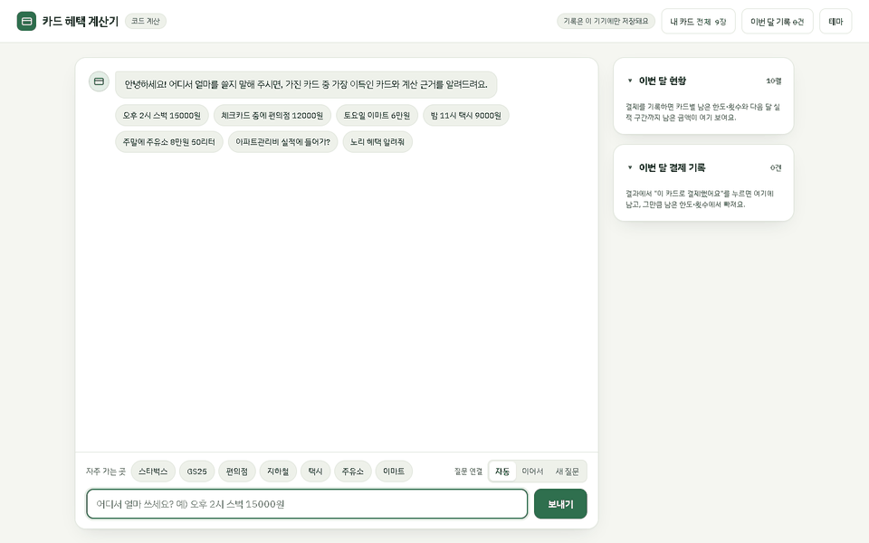
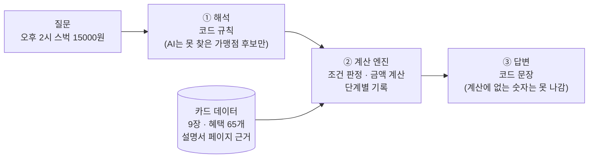
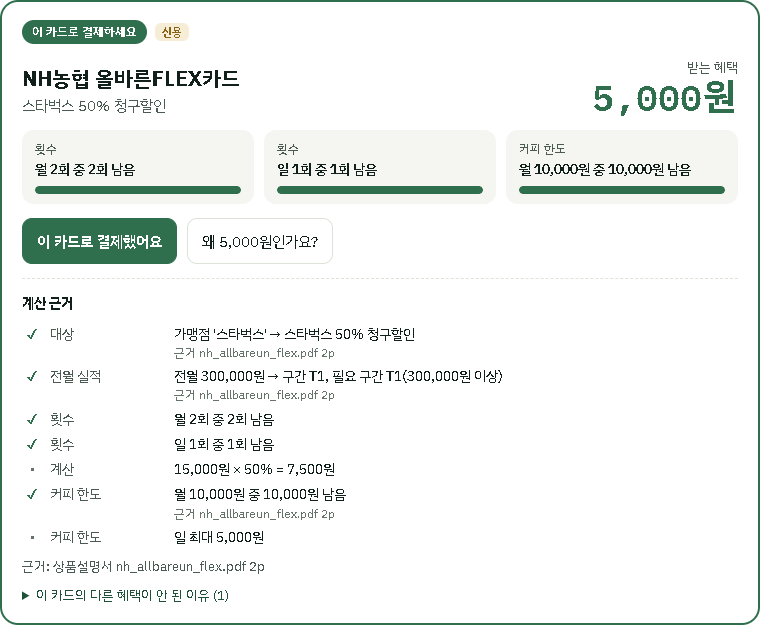
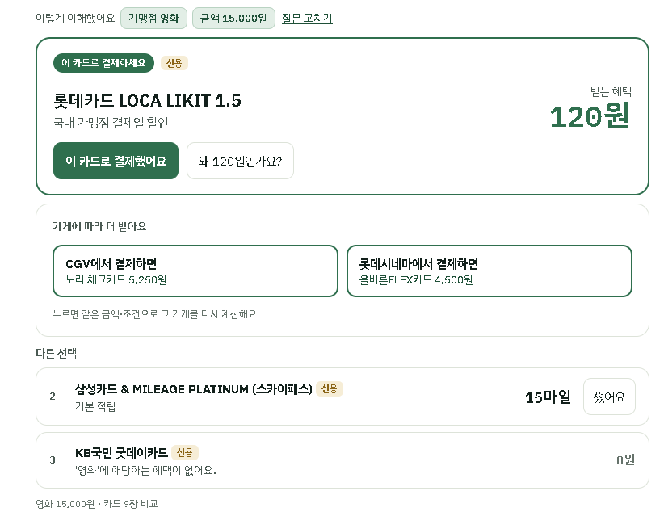
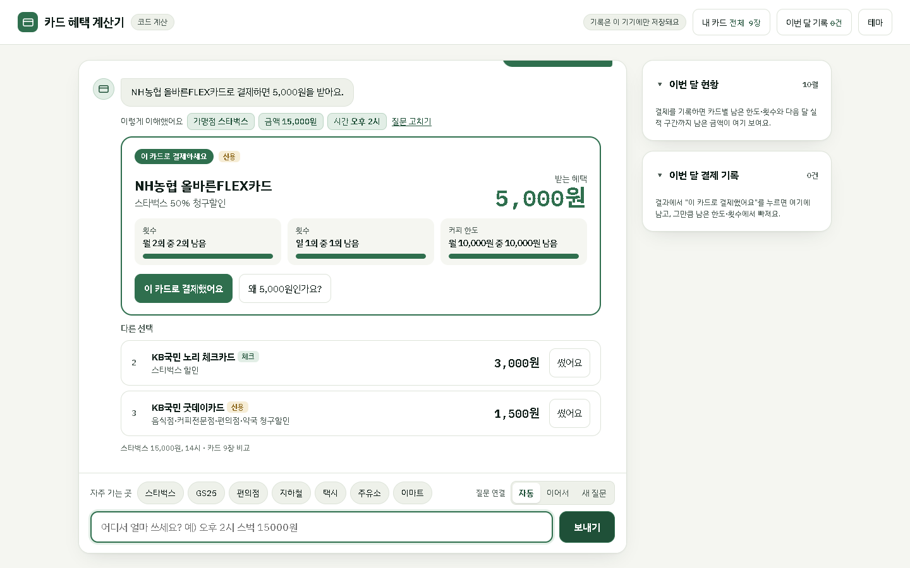
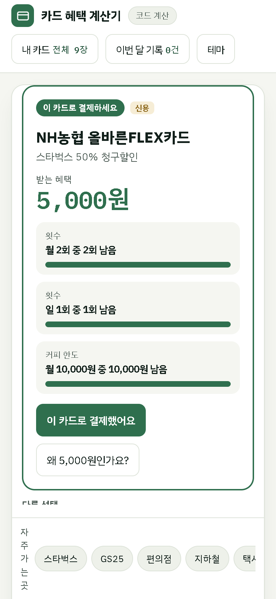
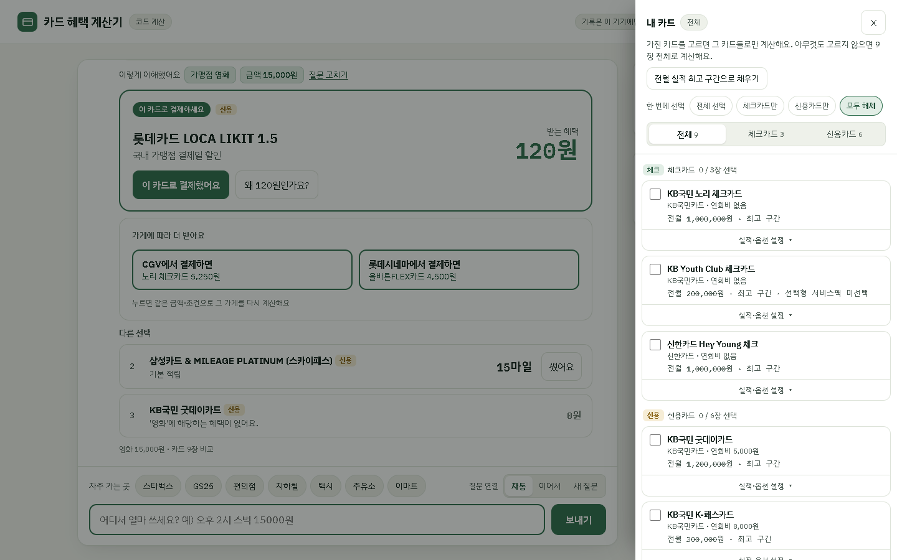
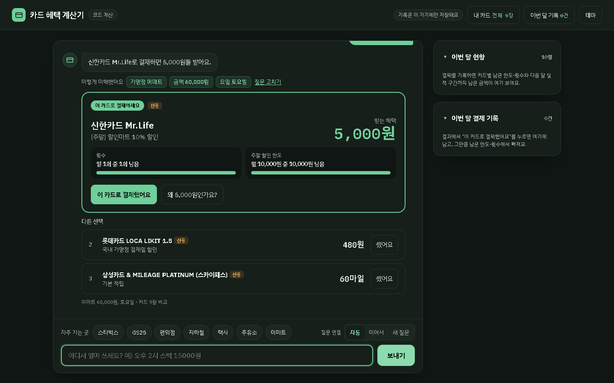

# 💳 카드 혜택 챗봇

**"어디서 얼마 쓰면, 어떤 카드가 이득일까?"**
보유한 카드의 상품설명서를 근거로, 가장 이득인 카드와 받는 금액, 계산 근거(설명서 페이지)까지 알려주는 챗봇입니다.



```
질문: 오후 2시 스벅 15000원

👉 가장 이득: NH농협 올바른FLEX카드 5,000원 (스타벅스 50% 청구할인)
   2위 KB국민 노리 체크카드 3,000원 · 3위 KB국민 굿데이카드 1,500원
```

---

## 왜 만들었나

카드 혜택은 전월 실적 구간, 일·월 한도, 시간대·요일, 결제수단(KB Pay 등), 제외 가맹점이 겹쳐 있어서 직접 계산하기 어렵습니다.
그렇다고 GPT에게 그냥 물으면 근거 없는 숫자를 지어냅니다 (예: "CGV 18,000원 → 18,000원 할인").
처음 보는 15문항에서 카드 자료 없는 GPT는 1위 금액을 **1개**만 맞혔습니다.

## 핵심 설계: 계산은 코드가, AI는 최소한만



- **해석**: 가맹점·금액·시각·요일·결제수단·카드 이름을 코드 규칙으로 읽습니다. 같은 질문은 항상 같은 해석이 나옵니다.
- **계산 엔진**: 가맹점 → 옵션 → 결제수단·시간 → 전월 실적 → 최소 결제 → 대상 금액 → 계산 → 건당·월·공유 한도 → 횟수 순서로 판정하고, 각 단계를 기록합니다.
- **답변**: 계산 결과로만 문장을 만듭니다. 조건을 하나씩 바꿔 다시 계산해서 개선 제안도 만듭니다 (예: "KB Pay로 결제하면 +600원", "토·일요일에 결제하면 Mr.Life 5,000원").

같은 설명서를 줘도 GPT가 계산하면 처음 보는 문항 **5/15**, 코드 엔진이 계산하면 **15/15**였습니다.

## 화면

| 결과와 계산 근거 | 가게별로 다른 혜택 |
|---|---|
|  |  |

| 데스크톱 | 모바일 |
|---|---|
|  |  |

| 내 카드 선택 | 다크 테마 |
|---|---|
|  |  |

**주요 기능**
- 상위 3개 카드만 보여주고 1위 강조, "왜 5,000원인가요?"를 누르면 조건 판정(✓/✗)·계산식·설명서 페이지
- 후속 질문: "그럼 체크카드는?", "KB Pay로 하면?", "토요일이면?" (이어지는 질문만 이전 조건을 참고)
- 카드 정보("노리 혜택 알려줘"), 전월 실적 포함 여부("관리비 실적에 들어가?"), 카드끼리 비교
- 보유 카드 선택(전체·체크만·신용만), 전월 실적 입력, 이번 달 사용 기록 반영(남은 한도·횟수)
- 업종으로 물으면 가게별 혜택 안내 ("영화 15000원" → CGV에서는 노리 5,250원)
- 라이트/다크 테마, 모바일 화면

## 카드 데이터

설명서 PDF를 **카드 9장(체크 3, 신용 6), 혜택 65개**의 JSON으로 옮겼습니다.
모든 혜택이 같은 41개 필드를 쓰고, 모든 혜택에 설명서 파일과 페이지를 근거로 남겼습니다. 사람 검수를 마쳤습니다.

| 체크카드 | 신용카드 |
|---|---|
| KB국민 노리 체크 · 신한 Hey Young 체크 · KB Youth Club 체크 | KB국민 K-패스 · KB국민 굿데이 · 롯데 LOCA LIKIT 1.5 · NH농협 올바른FLEX · 삼성 & MILEAGE PLATINUM(스카이패스) · 신한 Mr.Life |

데이터 구조와 카드 추가 방법: [card-chatbot/data/cards/README.md](card-chatbot/data/cards/README.md)

## 실행 방법

Python 3.10 이상 (3.14에서 확인). Windows 기준이며, macOS·Linux는 `.venv/bin/python`을 쓰면 됩니다.

```bash
cd card-chatbot
python -m venv .venv
.venv\Scripts\python.exe -m pip install -r requirements.txt
```

```bash
# 웹 화면 → http://localhost:8000
.venv\Scripts\python.exe src\server.py

# 터미널에서 바로 질문
.venv\Scripts\python.exe src\chatbot.py
```

**API 키 없이도 모두 동작합니다.** 계산은 항상 코드가 하기 때문입니다.
`.env.example`을 `.env`로 복사하고 `OPENAI_API_KEY`를 넣으면, 코드 규칙이 못 찾은 가맹점 이름만 AI(gpt-4o-mini)가 후보를 제안합니다.

## 테스트

정답은 챗봇 출력이 아니라 **설명서를 보고 따로 계산**했습니다 (출력을 정답으로 옮기면 틀린 계산이 정답으로 굳기 때문).

| 테스트 | 문항 | 결과 | 실행 |
|---|---|---|---|
| 계산 평가 (설명서 정답과 숫자 일치) | 133 | 133/133 | `python -m unittest tests.test_engine` |
| 질문 해석·답변, 후속 대화, 서버 API | — | 통과 | `python tests/run_all.py` |
| 공격 테스트 (일부러 헷갈리게 만든 질문) | 124 | 124/124 | `python tests/run_adversarial.py` |
| 성질 검사 (같은 뜻 다른 표현 등 수천 조합) | — | 오류 0건 | `python tests/run_property.py` |
| 많이 물을 질문 (편의점·카페·배달·OTT·해외 등) | 76 | 76/76 | `python tests/run_popular.py` |

공격 테스트와 많이 물을 질문 테스트로 찾아 고친 오류 예시:

| 질문 | 잘못된 결과 | 원인 |
|---|---|---|
| 이마트24 12000원 | 241만 2천원으로 계산 | 가게 이름의 숫자가 금액에 붙음 |
| 아마존 직구 5만원 | 95만원 | "직구"의 "구"를 숫자 9로 읽음 |
| KB Pay **말고** 실물카드로 | KB Pay로 계산 | 부정 표현 미처리 |
| 일본에서 1만엔 | 10,000원으로 계산 | 통화 단위 무시 → 원화 금액을 되묻도록 수정 |

## 최종 측정 (홀드아웃)

코드를 동결한 뒤(`37b55cd`), 개발 중 한 번도 보지 않은 15문항을 먼저 커밋해 잠그고(`4b172c8`) **한 번만** 측정했습니다. 채점은 코드 자동 채점입니다.

| 방식 | 처음 보는 15문항 (1위 금액) | 개발 문항 100개 |
|---|---|---|
| GPT 빈손 (카드 자료 없음) | 1/15 | 11/100 |
| 고치기 전 (설명서 전체를 주고 GPT가 계산) | 5/15 | 42/100 |
| **고친 후 (코드 해석 + 계산 엔진)** | **15/15** | **100/100** |

- 개발 문항 100%는 고치면서 맞힌 결과라 일반화 성능은 홀드아웃으로 봐야 합니다.
- 홀드아웃 정답 계산은 AI(Claude)가 작성했고, 카드 데이터는 사람이 검수했습니다.
- 전체 보고서: [docs/final_report_2026-10-06.pdf](card-chatbot/docs/final_report_2026-10-06.pdf)

## 한계

- 처음 보는 표현 유형에서는 87%(26/30)였던 기록이 있어, 실제 사용자 표현에서 해석 오류가 날 수 있습니다.
- 홀드아웃이 15문항으로 작습니다.
- 일부 설명서가 오래됐습니다 (헤이영 2022년판, K-패스 2024년판). Mr.Life는 공식 설명서가 아닌 홈페이지 자료입니다.
- 이번 달 사용량은 사용자가 "썼어요"로 기록한 것만 반영해서 카드사 실제 집계와 다를 수 있습니다.
- 카드 혜택은 바뀔 수 있습니다. 실제 결제 전에는 카드사 안내를 확인하세요.

## 폴더 구조

```
card-chatbot/
├─ src/
│  ├─ chatbot.py       질문 해석 · 후속 질문 · 답변 문장
│  ├─ engine.py        계산 엔진 (조건 판정 · 한도 · 개선 제안)
│  ├─ normalizer.py    가맹점 이름 → 표준 이름 → 업종
│  ├─ card_schema.py   카드 데이터 구조 정의와 검사
│  ├─ card_summary.py  카드별 특징 요약 생성
│  └─ server.py        웹 서버 (추가 설치 없음)
├─ web/chat.html       채팅 화면
├─ data/cards/         카드 9장 JSON + 요약
├─ data/pdf/           원본 설명서 (저장소에는 올리지 않음)
├─ tests/              테스트 문항 · 실행 스크립트 · 결과
└─ docs/               측정 보고서 · 중간 점검 · 화면 캡처
```
